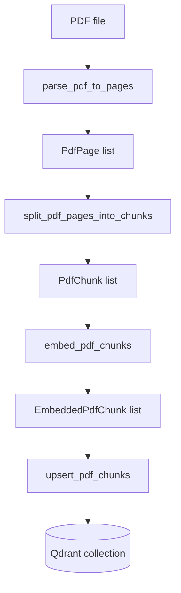
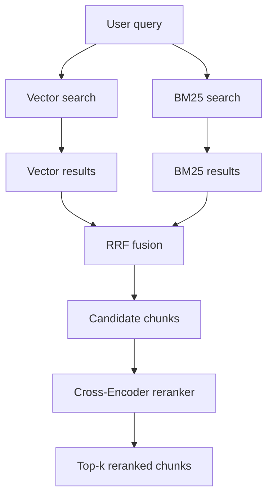
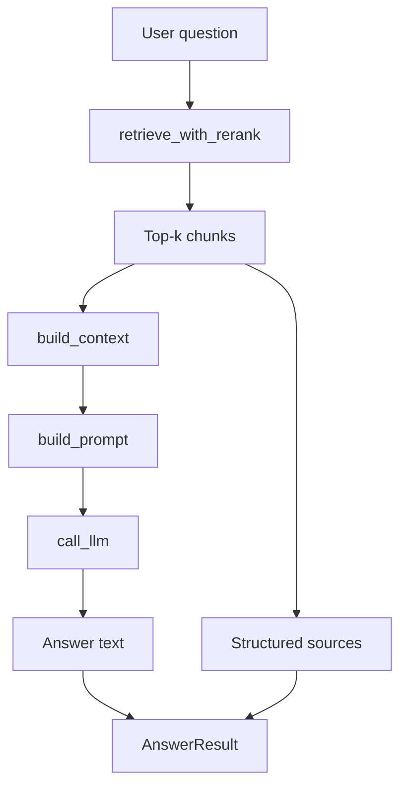

# Paper RAG Assistant

面向学术论文的 Advanced RAG 原型系统。项目目标不是简单地“读取 PDF -> 向量化 -> 调 LLM”，而是逐步构建一个可维护、可扩展、可评估的论文问答系统，覆盖 PDF 解析、语义 chunk、向量入库、Hybrid Search、Cross-Encoder Rerank、LLM Answer 和后续评估能力。

## 当前能力

- PDF 解析：基于 PyMuPDF 将论文 PDF 按页解析为结构化 `PdfPage`。
- Token-aware Chunking：使用 embedding 模型 tokenizer 控制 chunk 大小，保留标题、页码范围和稳定 `chunk_id`。
- Embedding：基于 SentenceTransformers 生成归一化向量。
- Vector Store：使用 Qdrant 存储 chunk 向量和 payload。
- Hybrid Retrieval：结合向量检索、BM25 关键词检索和 RRF 融合。
- Reranking：使用 Cross-Encoder 对候选 chunk 二阶段重排。
- Answer Generation：将 reranked chunks 构造成 context/prompt，调用 OpenAI-compatible LLM 接口生成答案和引用来源。

## 系统流程图

### 1. 索引流程



索引入口：

```python
from pipeline import index_pdf

result = index_pdf("data/paper.pdf")
print(result)
```

返回结构：

```python
{
    "source": "paper.pdf",
    "pages": 12,
    "chunks": 80,
    "collection_name": "knowledge_base",
}
```

### 2. 检索流程



Hybrid retrieval 由这些模块组合：

```text
retrieval/vector.py   -> dense vector retrieval
retrieval/bm25.py     -> keyword retrieval
retrieval/rrf.py      -> rank fusion
retrieval/hybrid.py   -> hybrid orchestration
retrieval/reranker.py -> cross-encoder reranking
```

### 3. 问答流程



问答入口：

```python
from pipeline import answer_query

result = answer_query("这篇论文的核心方法是什么？")
print(result["answer"])
print(result["sources"])
```

返回结构：

```python
{
    "query": "这篇论文的核心方法是什么？",
    "answer": "... [1] ...",
    "sources": [
        {
            "source": "paper.pdf",
            "chunk_index": 3,
            "page_start": 2,
            "page_end": 3,
            "heading": "Method",
            "score": 0.87,
            "retrieval_source": "rerank",
        }
    ],
}
```

## 核心设计

### Chunk 作为入库单位

系统不再以 sentence 为主要入库单位，而是以 chunk 为单位。每个 chunk 保留：

```python
{
    "source": "paper.pdf",
    "chunk_id": "stable-hash",
    "chunk_index": 0,
    "page_start": 1,
    "page_end": 2,
    "heading": "Introduction",
    "text": "...",
}
```

这样可以在回答时提供更完整的上下文，也能保留页码、章节等引用信息。

### Hybrid Search

纯向量检索容易漏掉专有名词、缩写、公式名和关键词。当前系统使用：

```text
Dense Vector Search + BM25 + RRF
```

其中：

- Dense Vector Search：召回语义相近内容。
- BM25：召回关键词精确匹配内容。
- RRF：融合不同检索器的排名，避免直接比较不同尺度的分数。

### Cross-Encoder Rerank

Hybrid Search 负责召回候选，Cross-Encoder 负责精排：

```text
(query, chunk_text) -> relevance score
```

推荐流程是先召回 `candidate_k=20`，再 rerank 出 `top_k=5`。

## 配置

项目使用 `config.yaml` 管理非敏感配置，API key 通过环境变量传入。

示例：

```yaml
qdrant_url: "https://your-qdrant-url:6333"
collection_name: "knowledge_base"
embed_model: "all-MiniLM-L6-v2"
embed_text_batch_size: 32
chunk_target_tokens: 220
chunk_overlap_tokens: 40
rerank_model: "cross-encoder/ms-marco-MiniLM-L-6-v2"
rerank_candidate_k: 20
rerank_top_k: 5
max_context_chars: 6000
llm_model: "deepseek-chat"
llm_api_key_env: "DEEPSEEK_API_KEY"
llm_url: "https://api.deepseek.com"
```

环境变量：

```bash
export QDRANT_API_KEY="your-qdrant-api-key"
export DEEPSEEK_API_KEY="your-llm-api-key"
```

如果使用其他 OpenAI-compatible 服务，可以修改：

```yaml
llm_model: "your-model"
llm_api_key_env: "YOUR_API_KEY_ENV"
llm_url: "https://your-openai-compatible-base-url"
```

## 安装

```bash
python -m venv .venv
source .venv/bin/activate
pip install -r requirements.txt
```

当前依赖：

```text
sentence-transformers
qdrant-client
pymupdf
PyYAML
```

如果使用 LLM 调用，还需要确保安装 OpenAI SDK：

```bash
pip install openai
```

## 使用示例

### 索引论文

```python
from pipeline import index_pdf

index_result = index_pdf("data/my-paper.pdf")
print(index_result)
```

### 提问

```python
from pipeline import answer_query

result = answer_query("论文提出的方法解决了什么问题？")
print(result["answer"])
for source in result["sources"]:
    print(source)
```

## 测试

当前测试入口：

```bash
python -B -m unittest test.py
```

`-B` 用于避免在只读缓存目录下写入 `__pycache__`。

当前测试覆盖了：

- chunking token window
- invalid overlap validation
- BM25 ranking
- RRF fusion
- Qdrant payload -> chunk conversion


## 当前限制

- PyMuPDF baseline parser 对双栏论文、表格、公式和复杂 layout 的处理仍然有限。
- BM25 当前基于内存中的 chunks，规模变大后应引入缓存或独立 sparse index。
- LLM 接口使用 OpenAI-compatible SDK，不同供应商可能需要 `responses` 或 `chat.completions` 的接口适配。
